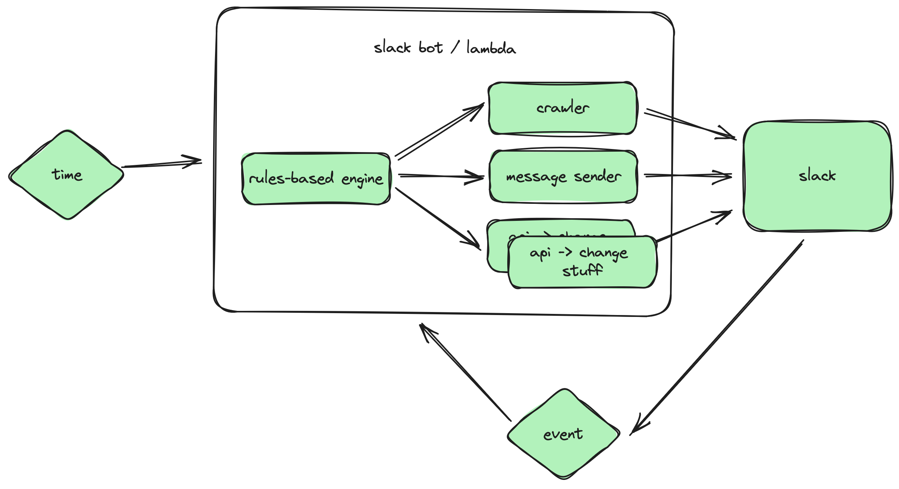

# hall-monitor

## Initial requirements / thoughts

* Enforce naming conventions
* Add Banners to Channels
* Expire external users based on TBD policy
* Identify when channels include external users
* Add CUI disclaimer to all channels (No sharing, uploading, discussion, eating of CUI)

## Basic hall-monitor bot diagram

### Parts and Pieces

* Triggers
    * Events - Slack notifies the bot when certain events occur (channel created, etc)
    * Time - cron job capability
* Slack Bot
    * rules-based engine - 
    * Generic libraries - called by the rules-based engine to accomplish things
        * crawler - able to pull information from Slack (get channels, users in channels, channels a user is in, etc)
        * message sender - send notification messages to individuals or rooms
        * api to change stuff - add channel descriptions or make 

## Tech Stack

* [Bolt Python](https://github.com/slackapi/bolt-python/tree/main/examples)
